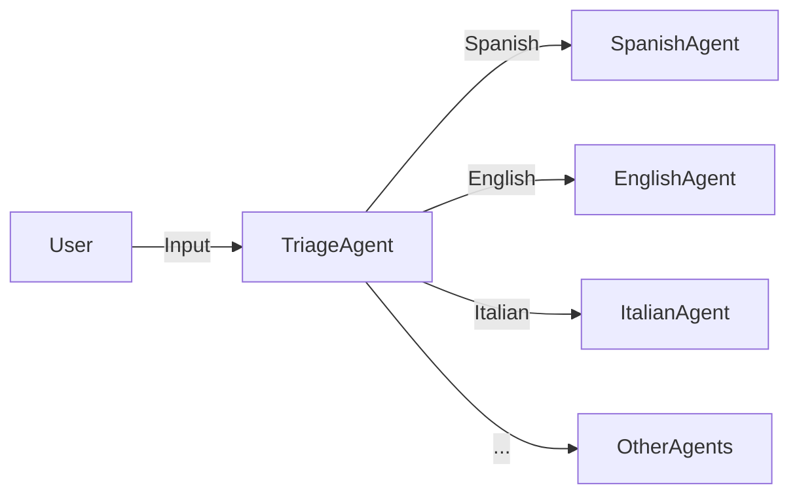

# **Multilingual Agent System** 
A language-routing system that delegates user queries to specialized agents based on the detected language.  

## **Features**  
1. Supports **5 languages**:  
- Spanish (`es`)  
- English (`en`)  
- Italian (`it`)  
- German (`de`)  
- French (`fr`)  

2. **Automatic language detection** via triage agent.  
3. **Asynchronous execution** for scalable handling.  

---

## **How It Works**  
1. **Triage Agent**: Detects the input language.  
2. **Handoff**: Routes the query to the correct language agent.  
3. **Response**: Agent replies in its assigned language.  



---

## **Installation**  
1. Ensure Python 3.7+ is installed.  
2. Install dependencies:  
   ```bash
   pip install asyncio  # (if not already included in your Python environment)
   ```

---


## **To Test All Languages**  
The included `main()` function tests all supported languages:  
```bash
python multilingual_agent.py
```

---

## **Example Outputs**  
| Input                          | Output (Agent Response)          |  
|--------------------------------|----------------------------------|  
| `"Hello, how are you?"`        | `"I'm doing well, thank you!"`   |  
| `"Ciao, come stai?"`           | `"Tutto bene, grazie!"`         |  
| `"Hallo, wie geht's?"`         | `"Mir geht es gut, danke!"`     |  


---
## **Usage**  
### **1. Define Agents**  
Each agent is configured to respond in a specific language:  
```python
spanish_agent = Agent(
    name="Spanish Agent",
    instructions="You only speak Spanish."
)
```

### **2. Run the System**  
Pass user input to the `triage_agent` for routing:  
```python
result = await Runner.run(triage_agent, input="Hola, ¿cómo estás?")
print(result.final_output)  # Output: ¡Hola! Estoy bien, gracias. ¿Y tú?
```
---

## **Extending to New Languages**  
1. Add a new agent (e.g., `japanese_agent`).  
2. Update `triage_agent`’s `handoffs` list.  

```python
japanese_agent = Agent(
    name="Japanese Agent",
    instructions="You only speak Japanese."
)

triage_agent.handoffs.append(japanese_agent)
```
